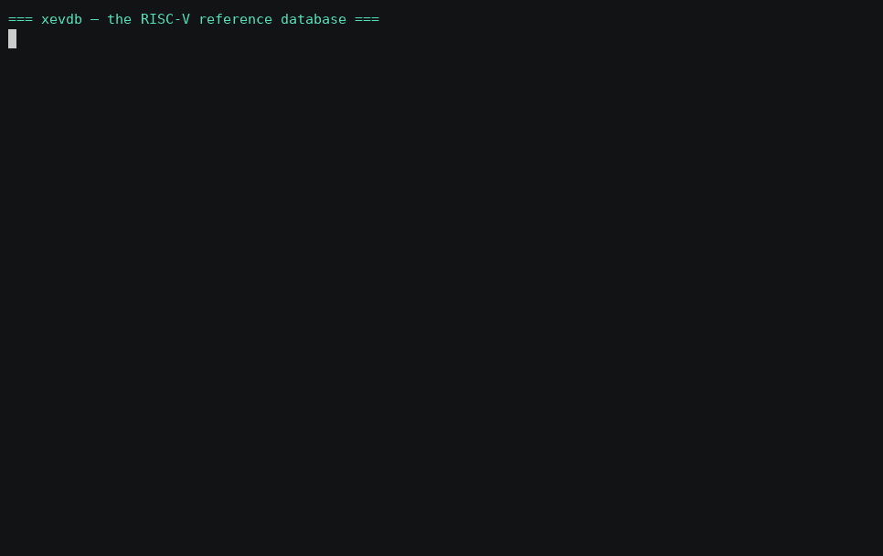

# Tutorial: the RISC-V reference database

xevdb can host a **standalone, searchable RISC-V knowledge base** on OpenSearch —
the ISA (instructions, registers, CSRs, extensions, pseudo-instructions) plus the
RISC-V **Linux kernel architecture** (syscalls, trap causes, the SBI ABI, the
virtual-memory layout). It needs no waveform: it's reference data you build once
and query forever, by hand or from an AI agent.

This tutorial builds it and walks through decoding a real RISC-V trace with it.



---

## 1. Prerequisites

A reachable OpenSearch cluster and xevdb installed with the OpenSearch extra:

```sh
bash install.sh --with-opensearch          # or: pip install -e '.[opensearch]'
export XEVDB_OPENSEARCH_HOSTS=localhost:9200
```

> No cluster handy? A single-node OpenSearch from the tarball works without
> Docker or root (`discovery.type: single-node`, `plugins.security.disabled:
> true`, plain HTTP on `:9200`).

---

## 2. The pointer file

An OpenSearch dataset is addressed by a tiny **pointer file** (the small artifact
you'd hand someone, in place of a `.xevdb`). For a reference DB, create one and
include the timeout knobs — a slow single node spends ~3 s per index-create, and
a build makes several, which can exceed the client's default 10 s timeout:

```sh
cat > riscv.ptr.json <<'JSON'
{
  "backend": "opensearch",
  "hosts": ["localhost:9200"],
  "dump_id": "riscv",
  "prefix": "xevdb",
  "extra": {"timeout": 180, "max_retries": 5, "retry_on_timeout": true}
}
JSON
```

Once the pointer exists, xevdb auto-routes to the OpenSearch backend — no
`--backend` flag needed. (When the pointer does *not* exist yet, pass
`--backend opensearch` so the first command can synthesize it.)

---

## 3. Build the ISA reference

```sh
xevdb ingest-riscv riscv.ptr.json --reset
```
```
ingested RISC-V ISA reference into riscv.ptr.json: 140 instructions, 64 registers, 36 csrs, 9 extensions, 21 pseudo
```

That's it — the data is bundled with the package, so this needs no network. It
seeds a set of `riscv_*` search prompts at the same time:

```sh
xevdb prompt list riscv.ptr.json | grep riscv_
```
```
riscv_by_extension    List the instructions defined by an ISA extension (RV32I/RV64I/M/A/F/D/C/Zicsr/...).
riscv_csr_by_addr     Decode a CSR number (e.g. 0x305 seen in csrr/csrw) to its name.
riscv_csr_lookup      Find a control/status register by name or description.
riscv_ext_overview    Instruction count per ISA extension (overview).
riscv_instr_by_name   Exact RISC-V instruction lookup (encoding + format) by mnemonic.
riscv_instr_search    Search RISC-V instructions by mnemonic, syntax, or description.
riscv_pseudo_search   Search pseudo-instructions and their real-instruction expansion.
riscv_reg_lookup      Resolve a register by x-name or ABI name (e.g. a0 -> x10, caller-saved).
```

---

## 4. Querying

Every query is `xevdb prompt run <pointer> <prompt> --arg KEY=VALUE`.

**Look up an instruction's encoding and format:**
```sh
xevdb prompt run riscv.ptr.json riscv_instr_by_name --arg name=jalr
```
```
name  extension  format  mask        match       syntax            description
jalr  RV32I      I       0x0000707f  0x00000067  jalr rd, imm(rs1)  Jump and link register: rd = pc+4; pc = (rs1+imm) & ~1.
```

**Resolve a register (x-name or ABI name):**
```sh
xevdb prompt run riscv.ptr.json riscv_reg_lookup --arg query=a0
```
```
name  abi  number  group  role                                saver
x10   a0   10      GPR    Function argument / return value 0  Caller
```

**Decode a CSR number** (the immediate in a `csrr`/`csrw`):
```sh
xevdb prompt run riscv.ptr.json riscv_csr_by_addr --arg addr=0x305
```
```
addr    name   privilege  access  description
0x305   mtvec  M          RW      Machine trap-handler base address.
```

**List an extension** / **see the overview:**
```sh
xevdb prompt run riscv.ptr.json riscv_by_extension --arg extension=M
xevdb prompt run riscv.ptr.json riscv_ext_overview
```
```
key      count
RV32I    40
A        22
C        18
F        16
M        13
D        12
RV64I    12
Zicsr     6
Zifencei  1
```

**Expand a pseudo-instruction:**
```sh
xevdb prompt run riscv.ptr.json riscv_pseudo_search --arg query=ret
```
```
name  expansion         base   description
ret   jalr x0, 0(ra)    jalr   Return from subroutine.
```

---

## 5. Add the Linux kernel architecture

The ISA and the kernel ABI can live in the **same** pointer (the software layer
on top of the instruction set) — just ingest into it too:

```sh
xevdb ingest-kernel riscv.ptr.json --reset
# ...or parse a real kernel checkout instead of the bundled snapshot:
xevdb ingest-kernel riscv.ptr.json --kernel-tree ~/src/linux --reset
```
```
ingested kernel architecture into riscv.ptr.json: 338 syscalls, 29 traps, 53 sbi, 32 memmap
```

**Decode a syscall** (the value in `a7` at an `ecall`):
```sh
xevdb prompt run riscv.ptr.json kernel_syscall_by_nr --arg nr=64
```
```
nr  name   entry      abi      description
64  write  sys_write  generic  Write to a file descriptor.
```

**Decode a trap cause** (an `scause`/`mcause` value — `kind` picks
exception vs. interrupt, since the cause MSB distinguishes them):
```sh
xevdb prompt run riscv.ptr.json kernel_trap_by_code --arg code=13 --arg kind=exception
```
```
code  kind       name                 label            description
13    exception  EXC_LOAD_PAGE_FAULT  Load page fault  Load page fault.
```

Also: `kernel_sbi_functions --arg extension=HSM`, `kernel_memmap_by_mode --arg
mode=Sv39`, and the `*_search` prompts for full-text lookups.

---

## 6. Worked example — reading a trap in a trace

You're staring at a RISC-V core in a waveform and the pipeline just took a trap.
You can read the raw values; the reference DB tells you what they *mean*.

| You see in the trace | Query | Answer |
| --- | --- | --- |
| `pc` reaches an `ecall`, `a7 = 64` | `kernel_syscall_by_nr --arg nr=64` | userspace called **write** |
| `scause = 0x0d` after a load | `kernel_trap_by_code --arg code=13 --arg kind=exception` | **load page fault** |
| handler reads `csr 0x305` | `riscv_csr_by_addr --arg addr=0x305` | it's loading **mtvec** (trap vector) |
| return uses `jalr x0, 0(x1)` | `riscv_pseudo_search --arg query=ret` | that's a **ret** (`x1`=`ra`) |

Four lookups turn an opaque sequence of numbers into "userspace did a `write`,
faulted on a load page fault, the M-mode handler set up `mtvec`, then returned."

---

## 7. JSON output (for tooling and AI)

Add `--json` to get structured rows instead of a table — this is what you feed an
agent or a script:

```sh
xevdb prompt run riscv.ptr.json riscv_csr_by_addr --arg addr=0x305 --json
```
```json
{
  "prompt": "riscv_csr_by_addr",
  "args": {"addr": "0x305"},
  "cache_hit": false,
  "rows": [
    {"id": "0x305", "addr": "0x305", "name": "mtvec",
     "privilege": "M", "access": "RW",
     "description": "Machine trap-handler base address.", "ingested_at": 1780612244.7}
  ]
}
```

**Using it with AI (evidence-first).** The deterministic query result *is* the
ground truth — give the model the JSON rows, not a guess. A typical loop: extract
the numbers from the trace → run the matching `*_by_*` prompt → hand the rows to
the model and ask it to narrate or suggest next steps. The model interprets
facts the tool proved; it never has to recall an opcode or CSR number from
memory.

---

## 8. Regenerating / customising the data

- **RISC-V ISA** is curated in `scripts/gen_riscv_data.py` (encodings computed
  from each instruction's fixed bit-fields). Edit/extend and re-run:
  `python scripts/gen_riscv_data.py`.
- **Kernel data** is *parsed from a tree*. Point the generator at any checkout:
  `python scripts/gen_kernel_data.py --kernel-tree ~/src/linux` (it reads the
  generic `unistd.h`, `csr.h`, `sbi.h`, and the `Documentation/arch/riscv/` rst).
  Both write committed JSON under `src/xevdb/data/`.

After regenerating, re-ingest with `--reset`.

---

## 9. Troubleshooting

- **`ConnectionTimeout` during ingest** — the cluster is slow creating indices.
  Raise the pointer's `extra.timeout` (see §2).
- **A query returns stale rows after re-ingesting** — the result cache is keyed by
  prompt + args. Clear it: `xevdb cache clear riscv.ptr.json` (or pass
  `--no-cache` on the query).
- **`opensearch-only` error** — RISC-V/kernel reference is OpenSearch-only. Make
  sure you're going through a pointer file (or pass `--backend opensearch`).
- **Nicer index names** — with `dump_id: "riscv"` the indices read
  `xevdb-riscv-riscv_instructions`. Use a different `dump_id` (e.g. `isa`) for
  `xevdb-isa-riscv_instructions`.
